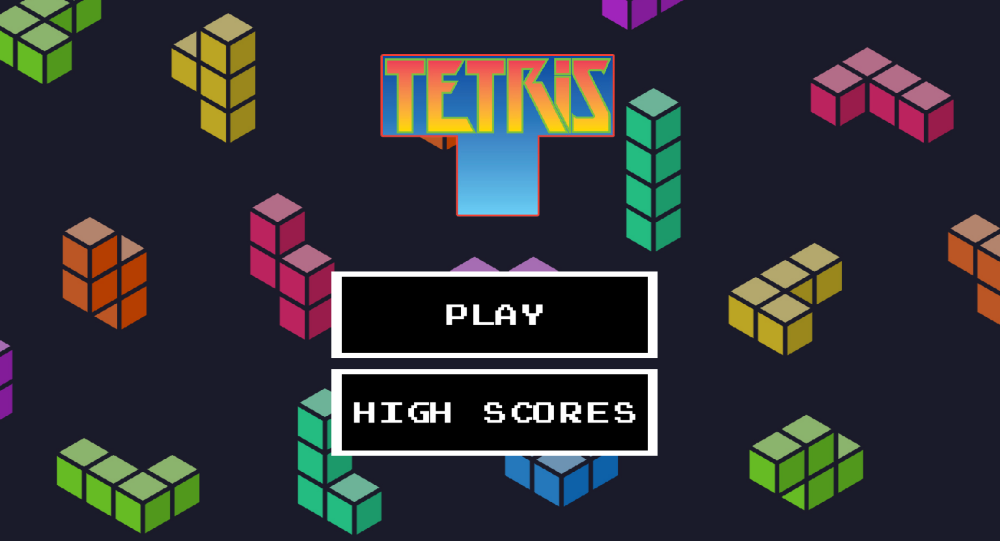

# TetrisGDX

TetrisGDX is a small clone of tetris made using the [LibGDX](https://libgdx.com/) Java game framework.

This game can be played online at [tetris.jaeheonshim.dev](https://tetris.jaeheonshim.dev). Alternatively, the game can be compiled into a JAR file. Support for mobile play is not yet supported.

This was a quick project, so there may be bugs in the game!